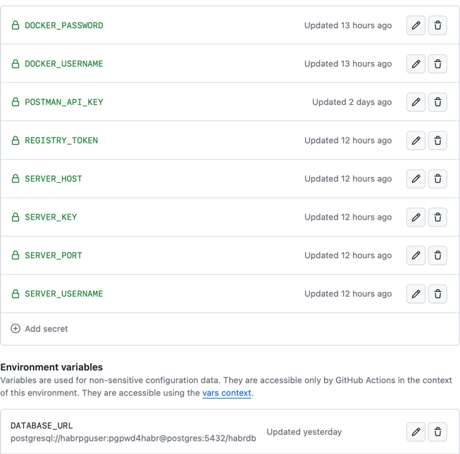

# Веб-приложение на Flask + PostgreSQL + Nginx

## Описание
Реализовано API для получения информации о пользователях и домашних животных.
Построена закрытая внутреняю сеть для контейнеров и проброс портов через Nginx

## Технологии
- Flask
- PostgreSQL + PgAdmin
- Nginx
- Docker
- Docker-compose

## Запуск
1. Склонировать репозиторий
```

```
2. Перейти в директорию проекта
```
cd pet-service
```
3. Установить переменные окружения

Локально:

Создать файл .env в корне проекта и прописать в нем переменные окружения



Или в удаленном репозитории.

3. Установить Docker

[Документация по установке Docker](https://docs.docker.com/get-docker/)
```
brew install docker
```
4. Запустить проект
```
docker-compose up -d --build
```
5. Веб приложение запущено:
```
http://0.0.0.0:80/
```


