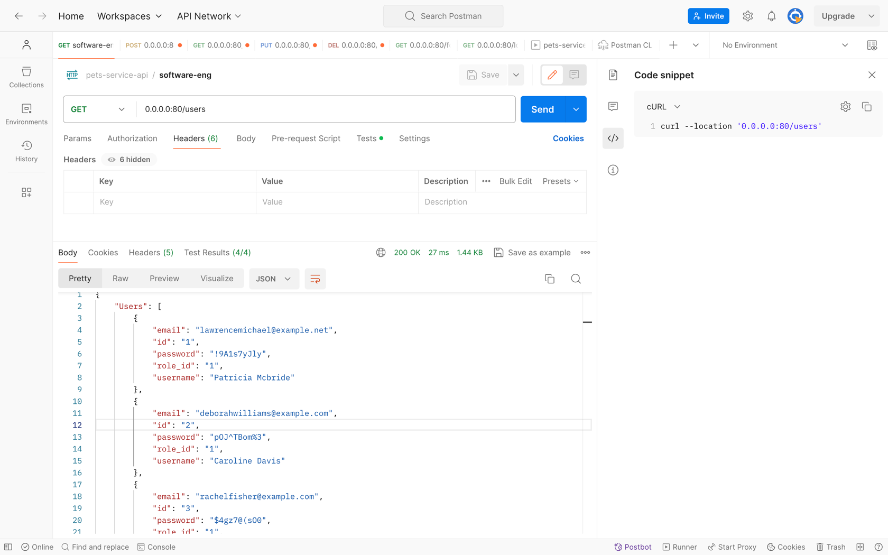
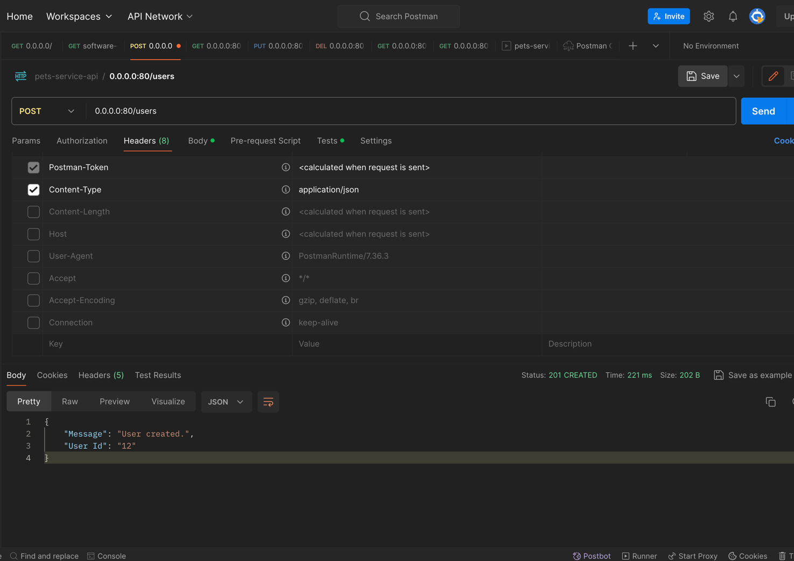
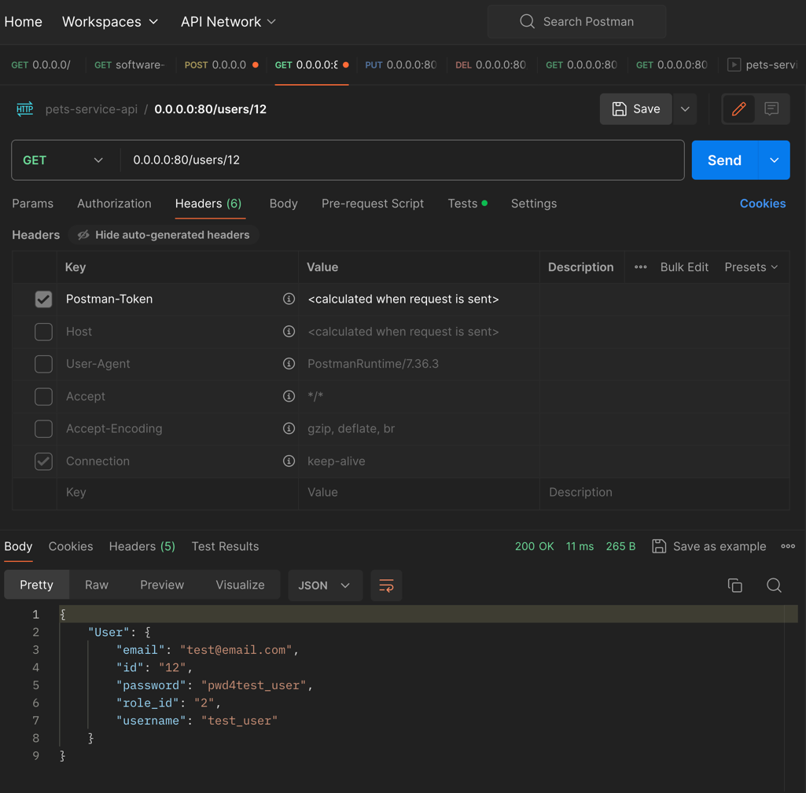
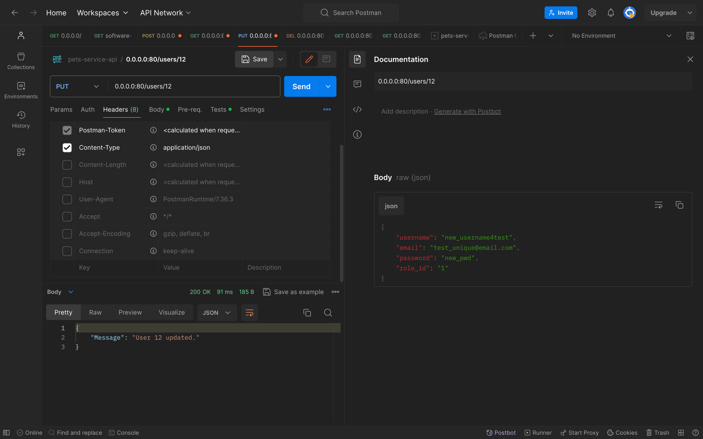
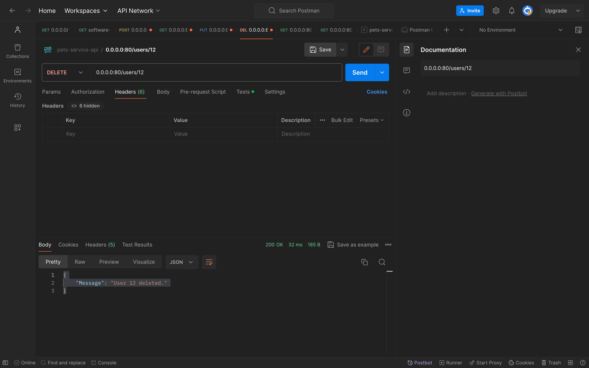
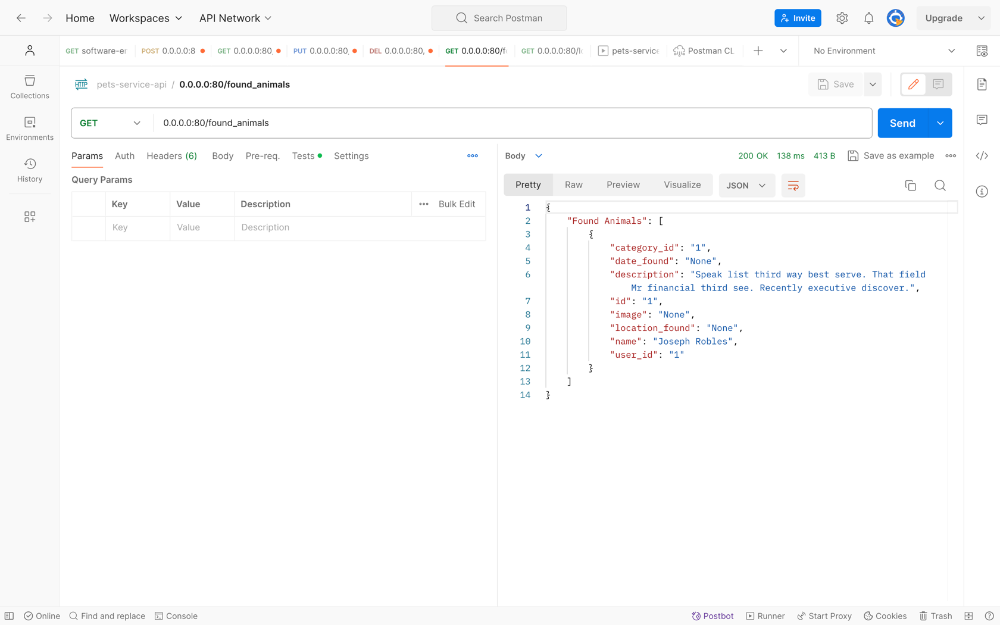

# Лабораторная работа №4 REST API

**Оглавление:**
- [Документация по API](backend/api_docs.md:8)
- [Реализация API](backend/routes.py)
- [Тестирование API](backend/api_docs.md:313)

## *Документация по API*

### *Работа с пользователем*

#### *GET /users*

**Описание:** Получение данных о пользователях.

**Заголовки:**

**Входные параметры:**  


**Пример входных параметров:**
```
/user/12
```

**Код статусы ответа:**
- `200 OK` - Успешный запрос, возвращается информация о пользователях
- `500 Unexpected Error` - Ошибка в ходе выполнения

**Пример ответа:**
```json
{
  "Users": [
    {
      "email": "lawrencemichael@example.net",
      "id": "1",
      "password": "!9A1s7yJly",
      "role_id": "1",
      "username": "Patricia Mcbride"
    },
    {
      "email": "deborahwilliams@example.com",
      "id": "2",
      "password": "pOJ^TBom%3",
      "role_id": "1",
      "username": "Caroline Davis"
    }
  ]
}
```

**cURL:** 
```
curl --location '0.0.0.0:80/users'
```

#### *POST /users/*

**Описание:** Создание пользователя. Возвращает Id созданого пользователя .

**Заголовки:**
- `Content-Type: application/json`

**Входные параметры:**  
Body:  
- `username` (строка) - Имя пользователя
- `password` (строка) - Пароль пользователя
- `email` (строка) - Email пользователя
- `role_id` (целое число) - Идентификатор роли пользователя

**Пример входных параметров:**
```json
{
    "username": "test_user",
    "email": "test@email.com",
    "password": "pwd4test_user",
    "role_id": "2"
}
```

**Код статусы ответа:**
- `201 Created` Успешно создан
- `500 Unexpected Error` - Ошибка в ходе выполнения

**Пример ответа:**
```json
{
    "Message": "User created.",
    "User Id": "12"
}
```

**cURL:**
```
curl --location '0.0.0.0:80/users' \
--header 'Content-Type: application/json' \
--data-raw '{
    "username": "test_user",
    "email": "test@email.com",
    "password": "pwd4test_user",
    "role_id": "2"
}'
```


#### *GET /users/{user_id}*

**Описание:** Получение данных о пользователе.

**Заголовки:**

**Входные параметры:**  
Query:  
- `user_id` (целое число) - Идентификатор пользователя, информацию о котором необходимо получить.

**Пример входных параметров:**
```
/users/12
```

**Код статусы ответа:**
- `200 OK` - Успешный запрос, возвращается информация о пользователе
- `500 Unexpected Error` - Ошибка в ходе выполнения

**Пример ответа:**
```json
{
    "User": {
        "email": "test@email.com",
        "id": "12",
        "password": "pwd4test_user",
        "role_id": "2",
        "username": "test_user"
    }
}
```

**cURL:** 
```
curl --location '0.0.0.0:80/users/12' 
```


#### *PUT /users/{user_id}*

**Описание:** Обновление данных пользователя.

**Заголовки:**
- `Content-Type: application/json`

**Входные параметры:**  
Query:  
- `user_id` (целочисленное число) - Идентификатор пользователя, информацию о котором необходимо обновить.

Body:  
- `username` (строка) - Имя пользователя
- `password` (строка) - Пароль пользователя
- `email` (строка) - Email пользователя
- `role_id` (целое число) - Идентификатор роли пользователя

**Пример входных параметров:**
```
/users/12
```
```json
{
    "username": "new_username4test",
    "email": "test_unique@email.com",
    "password": "new_pwd",
    "role_id": "1"
}
```

**Код статусы ответа:**
- `200 OK` - Успешное обновление данных пользователя
- `500 Unexpected Error` - Ошибка в ходе выполнения

**Пример ответа:**
```json
{
    "Message": "User 12 updated."
}
```

**cURL:** 
```
curl --location --request PUT '0.0.0.0:80/users/12' \
--header 'Content-Type: application/json' \
--data-raw '{
    "username": "new_username4test",
    "email": "test_unique@email.com",
    "password": "new_pwd",
    "role_id": "1"
}'
```


#### *DELETE /users/{user_id}*

**Описание:** Удаление пользователя.

**Заголовки:**

**Входные параметры:**  
Query:  
- `user_id` (целочисленное число) - Идентификатор пользователя, информацию о котором необходимо удалить.

**Пример входных параметров:**
```
/user/12
```

**Код статусы ответа:**
- `204 No Content` - Успешное удаление пользователя
- `500 Unexpected Error` - Ошибка в ходе выполнения

**Пример ответа:**
```json
{
    "Message": "User 12 deleted."
}
```

**cURL:** 
```
curl --location --request DELETE '0.0.0.0:80/users/12'
```

### *Работа с Домашними животными*

#### *GET /lost_animals/*

**Описание:** Получение данных о потеряных домашних животных.

**Заголовки:**

**Входные параметры:**  


**Пример входных параметров:**

**Код статусы ответа:**
- `200 OK` - Успешный запрос, возвращается информация о домашних животных.
- `500 Unexpected Error` - Ошибка в ходе выполнения

**Пример ответа:**
```json
{
    "Lost Animals": [
        {
            "category_id": "2",
            "date_last_seen": "None",
            "description": "Table quickly series. One road audience job share. Attack strong then quite both boy.",
            "id": "1",
            "image": "None",
            "location_last_seen": "None",
            "name": "Nathaniel Miller",
            "status_id": "1",
            "user_id": "1"
        }
    ]
}
```

**cURL:** 
```
curl --location '0.0.0.0:80/lost_animals'
```

#### *GET /found_animals*

**Описание:** Получение данных о найденых домашних животных.

**Заголовки:**

**Входные параметры:**  


**Пример входных параметров:**


**Код статусы ответа:**
- `200 OK` - Успешный запрос, возвращается информация о пользователях
- `500 Unexpected Error` - Ошибка в ходе выполнения

**Пример ответа:**
```json
{
    "Found Animals": [
        {
            "category_id": "1",
            "date_found": "None",
            "description": "Speak list third way best serve. That field Mr financial third see. Recently executive discover.",
            "id": "1",
            "image": "None",
            "location_found": "None",
            "name": "Joseph Robles",
            "user_id": "1"
        }
    ]
}
```

**cURL:** 
```
curl --location '0.0.0.0:80/found_animals'
```

## *Тестирование API*

### *Работа с пользователями*

#### *GET /users/*


#### *POST /users/*



#### *GET /users/{user_id}*



#### *PUT /users/{user_id}*



#### *DELETE /users/{user_id}*



### *Работа с Домашними животтными*


#### *GET /lost_animasl/*


#### *GET /found_animals*




